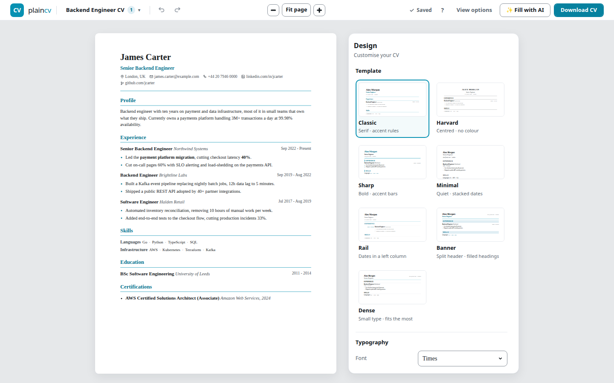
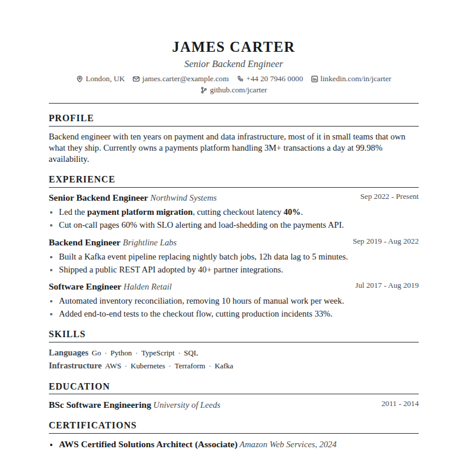
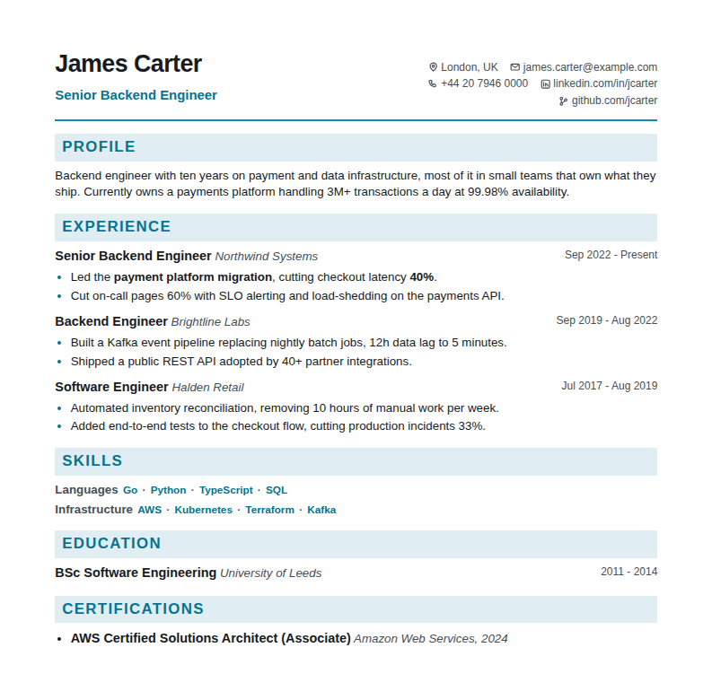

# PlainCV

**A CV is one page of text. Why does making one eat an afternoon?**

PlainCV is a CV builder with no account, no server and no forms. Click the text
on the page and type. The page you edit *is* the PDF that comes out.

Live at **[plaincv.net](https://plaincv.net)**.



## What it does

- **No form.** Click any line and type. Add, delete and drag controls show up
  next to the thing they act on, and hide again when you leave.
- **Seven templates**, each a preset over four layout axes (header, dates,
  headings, skills) plus a colour. Shuffle picks a combination that holds
  together, for when you cannot decide.
- **One page, enforced.** Anything past A4 falls below a red dashed line.
  *Fit to page* shrinks line spacing, then margins, then type size until it fits.
- **A PDF a parser can read.** Real text, clickable links, embedded fonts, no
  column tricks. `npm run ats-check` pushes every template through poppler, the
  same text extractor a lot of CV screeners sit on, and fails if the text comes
  back scrambled.
- **Your CV stays in your browser.** IndexedDB, no account, no upload, no server
  to leak. Back up to JSON whenever you like.
- **"Fill with AI" with no API key.** Copy the prompt, paste it into whatever
  chatbot you already have open, paste the JSON back.

| | |
|:---:|:---:|
|  |  |

## Run it

```
npm install
npm run dev
```

Build with `npm run build`. Push to `master` and GitHub Actions ships it to
Cloudflare Pages.

## Credits and licence

Source is public to read, not to reuse: see [LICENSE](LICENSE), all rights
reserved. Bundled fonts and the one sound effect keep their own licences; see
[CREDITS.md](CREDITS.md).

Built by Gurur Kisla Ozatmaca:
[GitHub](https://github.com/GururOzatmaca) ·
[LinkedIn](https://www.linkedin.com/in/gurur-kisla-ozatmaca)
